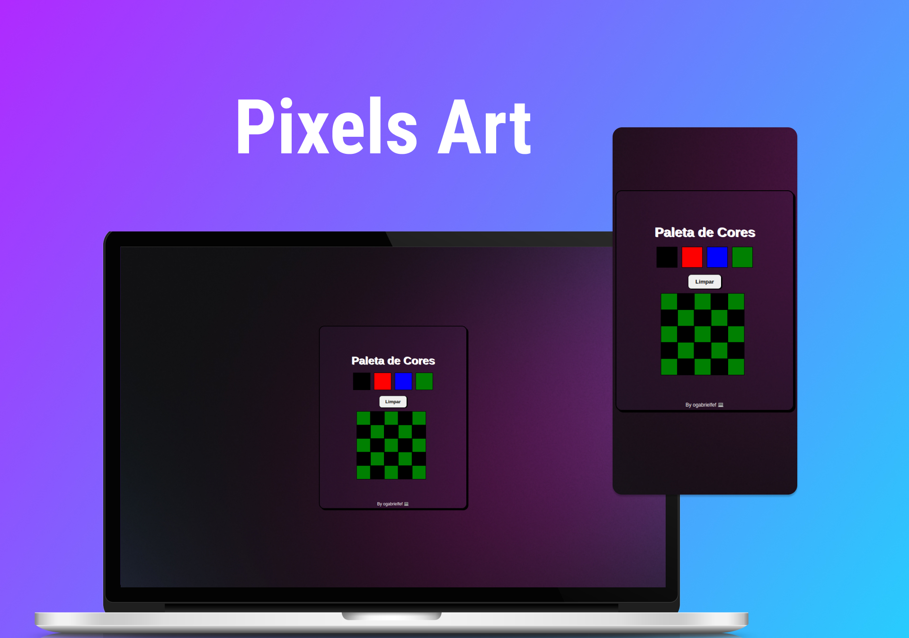

<h1 align="center"> Pixels Art </h1>

Projeto realizado no módulo de Front End no curso da Trybe.  

  <a href="#-tecnologias">Tecnologias</a>&nbsp;&nbsp;&nbsp;|&nbsp;&nbsp;&nbsp;
  <a href="#-projeto">Projeto</a>

 

  

## 🚀 Tecnologias

Esse projeto foi desenvolvido com as seguintes tecnologias:

- HTML e CSS
- JavaScript
- Git e Github

## 💻 Projeto

Pixels Art utiliza JavaScript para gerar e mudar o css dos 'pixels', dando vida aos componentes e posibilitando fazer desenhos pixelizados.

 

<h2 align="center">Feito com ♥ by ogabrielfef</h2>
